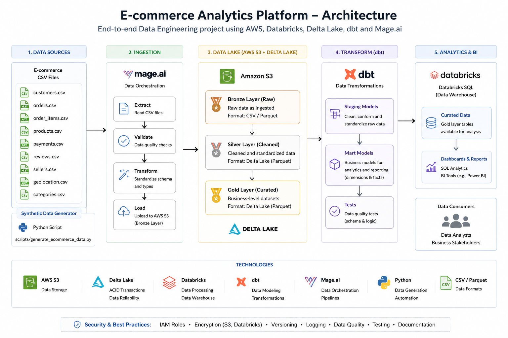
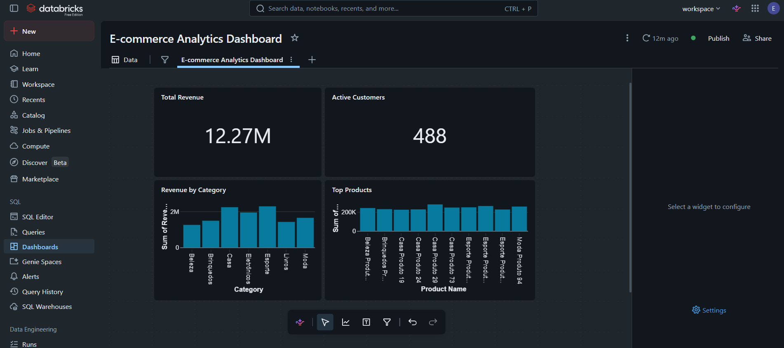
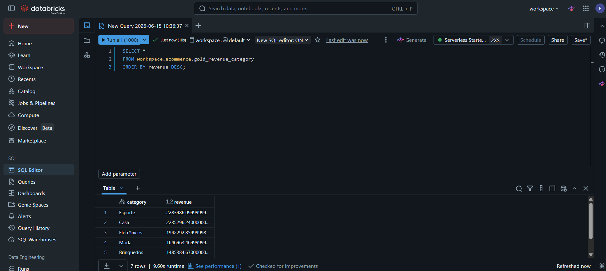
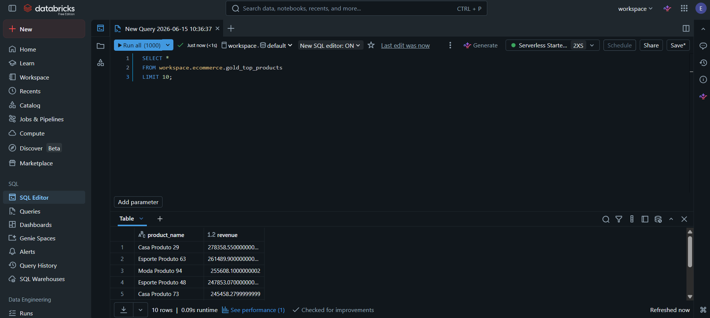

# E-commerce Analytics Platform

End-to-end Data Engineering project built using AWS S3, Databricks, Delta Lake, dbt and Mage.ai.

## Project Overview

This project simulates a real-world e-commerce analytics platform, implementing a complete modern data engineering workflow from ingestion to business analytics.

Key capabilities:

* Data ingestion from CSV files
* Bronze, Silver and Gold architecture
* Delta Lake storage
* Incremental processing with MERGE
* Data Quality validation
* Data modeling with dbt
* Pipeline orchestration with Mage.ai
* Analytical dashboards in Databricks

---

## Architecture



---

## Technology Stack

* AWS S3
* Databricks
* Delta Lake
* PySpark
* SQL
* dbt
* Mage.ai
* DuckDB
* GitHub

---

## Data Pipeline

CSV Files

↓

AWS S3

↓

Bronze Layer

↓

Silver Layer

↓

Gold Layer

↓

dbt Models

↓

Mage.ai Orchestration

↓

Analytics Dashboard

---

## Incremental Processing

The project implements incremental ingestion using Delta Lake MERGE operations.

Benefits:

* Reduced processing time
* Lower compute cost
* Near real-time updates
* Scalable architecture

---

## Data Quality

Implemented validations:

* Null checks
* Referential integrity
* Duplicate detection
* Order consistency validation

---

## Dashboard

### Executive Dashboard



### Revenue by Category



### Top Products



---

## Project Structure

```text
data/
databricks/
dbt/
mage/
scripts/
docs/images/
```

---

## Business Insights

Examples generated by the platform:

* Top revenue categories
* Best-selling products
* Active customers
* Revenue KPIs
* Customer behavior analysis

---

## Author

Igor Elipechuk

Data Engineering Portfolio Project
